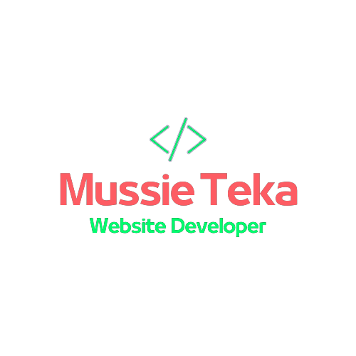

<a name="readme-top"></a>

<div align="center">
  
  <br/>
  <h3><b>HummingBird BootCamp Capstone Project</b></h3>
</div>

# 📗 Table of Contents

- [📖 About the Project](#about-project)
  - [🛠 Built With](#built-with)
    - [Tech Stack](#tech-stack)
    - [Key Features](#key-features)
  - [🚀 Live Demo](#live-demo)
- [💻 Getting Started](#getting-started)
  - [Setup](#setup)
  - [Prerequisites](#prerequisites)
  - [Install](#install)
  - [Usage](#usage)
  - [Run tests](#run-tests)
  - [Deployment](#triangular_flag_on_post-deployment)
- [👥 Authors](#authors)
- [🔭 Future Features](#future-features)
- [🤝 Contributing](#contributing)
- [⭐️ Show your support](#support)
- [🙏 Acknowledgements](#acknowledgements)
- [❓ FAQ (OPTIONAL)](#faq)
- [📝 License](#license)

<!-- PROJECT DESCRIPTION -->

# 📖 [HummingBird Boot Camp Capstone Project] <a name="about-project"></a>

This is the repository for the **HummingBird Boot Camp Capstone Project**. The goal of this project was to create a fully responsive website with two pages, home, and about, using a CSS framework and JavaScript to create dynamic content.

## 🛠 Built With <a name="built-with"></a>

### Tech Stack <a name="tech-stack"></a>

- Client: HTML, CSS, JavaScript
- Server: Not applicable
- Database: Not applicable

<details>
  <summary>Client</summary>
  <ul>
    <li><a href="https://www.w3.org/html/">HTML</a></li>
    <li><a ref="https://www.w3.org/Style/CSS/">CSS</a></li>
    <li><a href="https://developer.mozilla.org/en-US/docs/Web/JavaScript">JS</a></li>
  </ul>
</details>

The project was built using the following technologies:

- HTML
- CSS
- JavaScript
- Bootstrap CSS framework
- Lato font

### Key Features <a name="key-features"></a>

> Describe between 1-3 key features of the application.

- **Dynamic creation of the "Guest Instructors" section using JavaScript**
- **Responsive design for mobile and desktop screens**
- **Navigation menu with links to the home and about pages**

<p align="right">(<a href="#readme-top">back to top</a>)</p>

## 🚀 Live Demo <a name="live-demo"></a>

- [Live Demo Link](https://google.com)

<p align="right">(<a href="#readme-top">back to top</a>)</p>

## 💻 Getting Started <a name="getting-started"></a>

To get a local copy of the project up and running, follow these steps

### Prerequisites

In order to run this project, you need to have a web browser installed on your computer.

### Setup

Clone this repository to your desired folder by running the following command:

```sh
  git@github.com:MussieTeka/Capstone-Project.git
```

### Install

There are no installation steps required for this project.

### Usage

To run the project, open the index.html file in your web browser.

### Run tests

To run tests, run the following command:

```sh
 npx hint .
 npx stylelint "**/*.{css,scss}"
 npx eslint .
```

### Deployment

You can deploy this project using any web hosting service of your choice.

<p align="right">(<a href="#readme-top">back to top</a>)</p>

<!-- AUTHORS -->

## 👥 Author <a name="authors"></a>

This project was developed by:

👤 **Mussie Kahsay** - Developer

- GitHub: [@MussieTeka](https://github.com/MussieTeka)
- Twitter: [@mussieteka](https://twitter.com/mussieteka)
- LinkedIn: [@mussieteka](https://linkedin.com/in/mussieteka)

<p align="right">(<a href="#readme-top">back to top</a>)</p>

## 🔭 Future Features <a name="future-features"></a>

- **Adding the remaining pages to the website.**
- **Integrating with hosting sites to deploy the website.**
- **Implementing a search functionality to allow users to search for speakers or events.**

<p align="right">(<a href="#readme-top">back to top</a>)</p>

## 🤝 Contributing <a name="contributing"></a>

Contributions, issues, and feature requests are welcome!

Feel free to check the [issues page](../../issues/).

<p align="right">(<a href="#readme-top">back to top</a>)</p>

## ⭐️ Show your support <a name="support"></a>

If you like this project, please give it a star on GitHub.

<p align="right">(<a href="#readme-top">back to top</a>)</p>

## 🙏 Acknowledgments <a name="acknowledgements"></a>

I would like to thank the following resources and individuals for their help and inspiration:

- Cindy Shin on https://www.behance.net/gallery/29845175/CC-Global-Summit-2015 for providing the original design that served as the inspiration for our project.
- Unsplash (https://unsplash.com/) for the beautiful pictures used in our project.
- Flaticon (https://www.flaticon.com/) for the icons used in our project.

<p align="right">(<a href="#readme-top">back to top</a>)</p>

## ❓ FAQ (OPTIONAL) <a name="faq"></a>

> Add at least 2 questions new developers would ask when they decide to use your project.

- **Can I modify and redistribute this project?**

  - Yes, you can modify and redistribute this project as long as you follow the terms of the MIT license.

- **How can I contribute to this project?**

  - Contributions, issues, and feature requests are welcome! You can check the issues page to see if there are any current issues or feature requests that you can work on. If not, feel free to submit a new issue or pull request. Before contributing, please read the CONTRIBUTING.md file for guidelines on how to contribute to this project.

<p align="right">(<a href="#readme-top">back to top</a>)</p>

<!-- LICENSE -->

## 📝 License <a name="license"></a>

This project is [MIT](./LICENSE) licensed.

_NOTE: we recommend using the [MIT license](https://choosealicense.com/licenses/mit/) - you can set it up quickly by [using templates available on GitHub](https://docs.github.com/en/communities/setting-up-your-project-for-healthy-contributions/adding-a-license-to-a-repository). You can also use [any other license](https://choosealicense.com/licenses/) if you wish._

<p align="right">(<a href="#readme-top">back to top</a>)</p>
